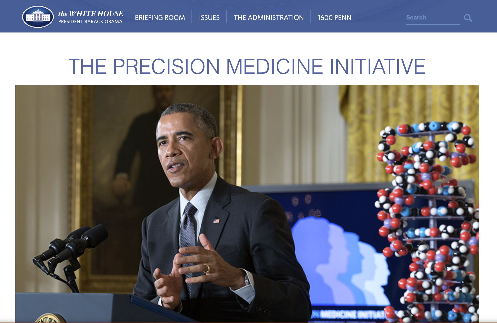
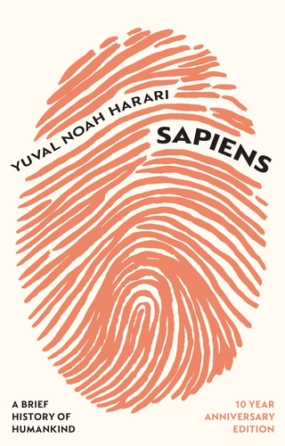
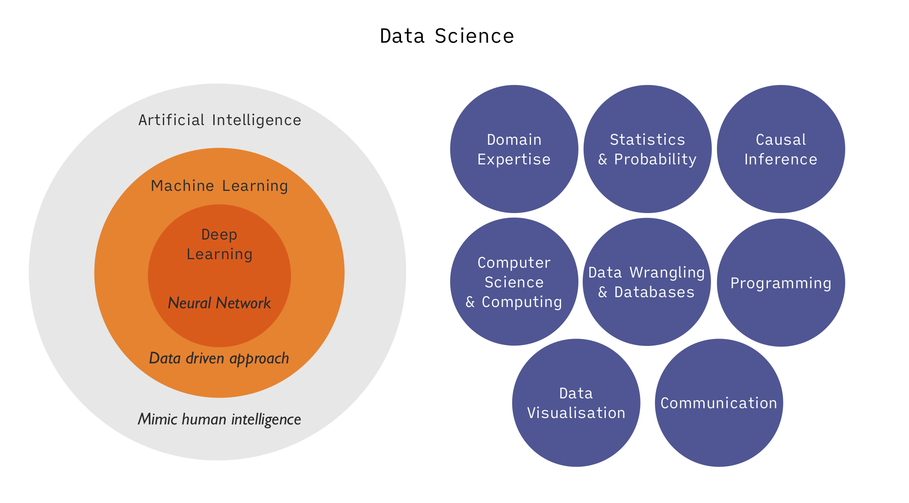

## 미래 데이터의 중요성
### 4차 산업혁명의 ‘원유'

- 다양한 소스들로부터 데이터 생성: 전지구적 개인과 환경에 대한 상세한 정보 발생
- 인터넷 & 통신 (SNS, 사진, 위치, 장소, 유동인구, 상품거래, 물류)
- 사물인터넷 (IoT), CCTV
- 스마트 팩토리, 파밍
- 게놈프로젝트, 생체정보, 의료/보건: 인류, 실시간
  - [23andMe](https://www.23andme.com/), [Theranos](https://youtu.be/_CnW12v-HKE?si=ykUsbr26EVzZe1BS&t=64)
- 과학적 발견: 물리법칙의 발견, 약물의 합성, 생체 내 상호작용의 메커니즘 규명
- 자율주행차량: 내부, 외부
- 금융정보 및 흐름
- 사회 지표 활용: 고용, 직업, 연봉, 만족도 조사, 취약 계층, 우울
- 생성형 인공지능: 기계의 정보 생산
- AI companion: 개인 내면에 대한 정보
  - [영화 Her (2013)](https://www.youtube.com/watch?v=4If1bduSw9k), [Sony’s robotics dog ‘Aibo’](https://www.youtube.com/watch?v=JKeZVuLEqhg)

## 데이터 사이언스의 응용 사례
### 영업 및 마케팅

- 웹사이트에서 고객의 구매 행동, 소셜 미디어의 댓글을 추적 고객의 선호도를 파악
- 월마트의 경우, 
  - 수 십년 넘게 매장의 재고 수준을 최적화했고, 2004년, 몇 주 전에 발생한 허리케인의 판매 데이터를 분석하여 "딸기 팝타트"를 재입고
  - 소셜 미디어 트렌드 및 신용카드 활동을 분석하여 신제품 출시 및 고객 경험 개인화/최적화
- 추천 시스템을 통해 사용자 취향에 맞는 제품을 추천하여 틈새 상품의 판매도 촉진

### 공공기관

- 미국의 경우, 정부 주도의 데이터 과학 이니셔티브 발족; 특히, 보건 분야에 큰 투자
  - Precision Medicine Initiative (2015)
    - 인간 게놈 시퀀싱과 데이터 과학을 결합하여 개별 환자를 위한 약물을 설계
    - 백만 명 이상의 자원봉사자로부터 환경, 라이프스타일, 생물학적 데이터를 수집하여 정밀 의학을 위한 세계 최대의 데이터를 구축  
    {width=250}
- 도시 운영 및 설계
    - 스마트 시티: 환경, 에너지, 교통 흐름을 추적, 분석, 제어
    - 장기적 도시 계획 수립에 정보를 축적
- 치안 및 범죄 예측
    - Police Data Initiative
      - 범죄 다발 지역과 재범률을 예측
      - 시민 단체들의 비판도 존재
    - [시카고 경찰; 1주일 이내의 범죄 예측](https://biologicalsciences.uchicago.edu/news/algorithm-predicts-crime-police-bias)
    - [비판: Event-level prediction of urban crime reveals a signature of enforcement bias in US cities. Nature human behaviour](https://www.nature.com/articles/s41562-022-01372-0)
- 각종 보험료 산정
    - 과거의 데이터를 분석하여, 보험금을 지급할 확률을 계산하고 보험료를 산정

### 스포츠

- Moneyball: The Art of Winning an Unfair Game 
  - 야구에서 전통적으로 강조되던 도루, 타점, 타율의 통계보다 출루율과 장타율이 더 나은 척도였음
  - "저평가된" 선수, 승리에 기여하는 능력에 비해 낮은 급여를 받는 선수를 찾아 영입
- Sabermetrics: sciecne of baseball
- 데이터 분석을 통해 시장에서 어떤 조직이 우위를 점할 수 있는 방법을 제시
- 적절한 속성을 찾는 것의 중요성

<!-- ### 개인정보의 가치

- 정보의 주권
- 매매
- 웹3(Web3) -->

## 사회적 파장
### 유토피아 vs. 디스토피아

- 초연결성, 투명성 vs. 완전한 감시와 통제
- 개인화된 서비스 vs. 설득/유혹/조작 
- 개별성/자율성 vs. 피동적/비주체적
- 기계/디지털과의 교감 vs. 인간관계의 소외, 현실과의 단절
- 정보와 인간에 대한 신뢰 vs. 사회적 연대, 문명 붕괴
- 자연과의 조화 vs. 생태계의 파괴

 

::: {layout-ncol=3}
{height=250 fig-align="left"} 

{height=250 fig-align="left"}

{height=250 fig-align="left"}

:::

Yuval Noah Harari: An Urgent Warning They Hope You Ignore.  
<iframe width="300" height="130" src="https://www.youtube.com/embed/UzOJiqN_DpM?si=Ri7ncgf_YSaTzTLH" title="YouTube video player" frameborder="0" allow="accelerometer; clipboard-write; encrypted-media; gyroscope; picture-in-picture; web-share" allowfullscreen></iframe>

The Social Dilemma (2020)  
<iframe width="300" height="130" src="https://www.youtube.com/embed/uaaC57tcci0?si=Jvl8Wx_DjshOiJN2" title="YouTube video player" frameborder="0" allow="accelerometer; autoplay; clipboard-write; encrypted-media; gyroscope; picture-in-picture; web-share" allowfullscreen></iframe>

<!-- https://youtu.be/UzOJiqN_DpM?si=riA3COID7hQBM72V -->

## Data Science

- Artificial intelligence (인공 지능)
- Machine learning (기계 학습)
- Deep learning (심층 학습)
- Data mining (데이터 마이닝)
- Statistical Learning (통계적 학습)

:::: {.columns}
::: {.column width="50%"}
### 소프트웨어 개발

데이터에 기반한 분석 위해 작동하도록 프로그래밍을 하여 운영되도록 하는 일  
주로 전통적인 컴퓨터 사이언스의 커리큘럼에 의해 트레이닝

- 유튜브의 영상 추천
- 페이스북의 친구 매칭
- 스팸메일 필터링
- 자율주행

:::

::: {.column width="5%"}
:::

::: {.column width="45%"}
### 데이터 분석

하나의 구체적인 질문에 답하고자 함  
다양한 소스의 정제되는 않은 데이터를 통합하거나 가공하는 기술이 요구

- DNA의 분석을 통해 특정 질병의 발병 인자를 탐색
- 유동인구와 매출을 분석해 상권을 분석
- 어떤 정책의 유효성을 분석에 정책결정에 공헌
- 교통 흐름의 지연이 어떻게 발생하는지를 분석, 해결책 제시

:::
::::

## Skills

{width=850}

- **Domain knowledge**
  - 해결하려는 문제에 대한 이해없이 단순한 알고리즘만으로 **"one size fits all"**은 효과적이지 않음
  - 추상화된 현실에 대한 모형은 수많은 **가정/사전 지식(prior knowledge)**을 전제하고 있음.
  - 각 분야의 전문 지식은 데이터가 발생되는 과정, 데이터의 특성, 데이터의 의미를 이해하는데 필수적

- **Ethics**
  - 데이터를 합법적이고 적절하게 사용하려면 규정을 이해하고, 자신의 업무에 미치는 영향과 사회에 미치는 파급력 대한 윤리적 이해가 필요
    - 배출(exhaust) 데이터: 어떤 목적을 가진 데이터 수집 프로세스로부터 얻어진 부산물
      - 소셜 미디어: 사용자가 다른 사람들과 소통할 수 있도록 도움
        - 공유된 이미지, 블로그 게시물, 트윗, 좋아요 등으로부터
        - 누가/얼마나 많이 보았는지/좋아요/리트윗을 했는지 등을 수집
      - 아마존 웹사이트: 다양한 물건을 편리하게 구매할 수 있도록 도움
        - 사용자가 장바구니에 어떤 품목을 담았는지, 사이트에 얼마나 오래 머물렀는지, 어떤 다른 품목을 보았는지 등을 수집
      - 메타데이터(metadata)
       - 통화 내역만으로 많은 민감한 정보을 유추할 수 있음
          - 알코올 중독자 모임, 이혼 전문 변호사, 성병 전문 병원 등
    - 한편, 서비스와 마케팅을 타겟팅할 수 있는 잠재력

- **Wrangling**
  - 데이터 소스는 다양한 형식으로 존재
  - 통합, 정리, 변환, 정규화 등의 작업이 요구
  - data munging, data wrangling, data cleaning, data preparation, data preprocessing 등으로 불림

- **Database & computer science**
  - 수집된 데이터가 저장되고, 가공/추출된 데이터의 재저장 등 데이터베이스와의 소통할 수 있는 기술
  - 다양해지고 방대해진 빅데이터를 저장/배포하기 위한 도구를 활용
  - ML 모델을 이해하고 개발하여 제품의 출시, 분석, 백엔드 애플리케이션에 통합할 수 있는 기술 등

- **Visualisation**
  - 작업 프로세스의 모든 과정에 관여
    - 데이터를 탐색하거나,
    - 데이터의 의미를 효과적으로 전달

- **Statistics & Probability**
  - 데이터 과학 프로세스 전반에 걸쳐 사용됨
    - 초기 수집과 조사
    - 다양한 모델과 분석의 결과를 해석
    - 의사결정에 활용

- **Machine Learning**
  - 데이터로부터 패턴을 찾기 위한 다양한 알고리즘을 사용
  - 응용 측면에서는
    - 수많은 알고리즘에 대해 가정, 특성, 용도, 결과의 의미, 적용가능한 유형의 데이터 등
    - 해결할 문제와 데이터에 가장 적합한 알고리즘을 파악

- **Communication**
  - 데이터에 담긴 스토리를 효과적으로 전달하는 능력
  - 분석을 통해 얻은 인사이트, 조직 내 목적에 어떻게 부합하는지, 조직의 기능에 미칠 수 있는 영향 등