## 데이터를 분석한다는 것은?

*Data is a window, not a mirror to reality!*

- 수많은 가정과 사전 지식을 전제로 함: 올바른 결과 뿐 아니라 효율적인 분석을 위해 필요
- 분석 결과는 주어진 **가정에 대한 분명한 제시**(transparency)와
- 그 가정을 기반으로 한 적절한 해석이 요구됨

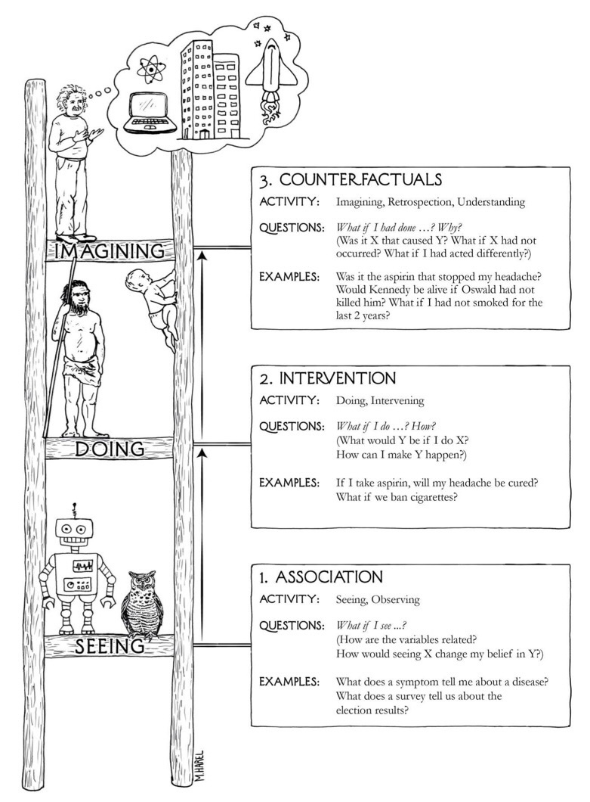{width=750}  
Source: *The Book of Why by Judea Pearl, Dana Mackenzie (2018)*

### 예측 모델 vs. 관계/원인 분석

::::: {.columns}
:::: {.column width="50%"}
::: {.fragment}
**예측 모델**  

예측의 신속성과 정확성  
Machine Learning 강점  
Algorithmic  

- 이미지/사물 인식
- 개인화된 추천 목록: 유튜브, 넷플릭스
- 시리, ChatGPT의 답변
- 비즈니스 분석
- 이상치 탐지
:::
::::

:::: {.column width="50%"}
::: {.fragment}
**관계/원인 분석**

현상/실재에 대한 이해과 매커니즘 파악  
Statistical Models 강점  
Parametric  

- 음식/운동의 효능
- 광고의 효과
- 복지/치안 정책의 효과

:::

::::
:::::

### Causal Inference

전형적인 인과적 질문들

:::: {.columns}
::: {.column width="50%"}
- How effective is a given treatment in **preventing** a disease?
- Was it the new tax break that **caused** our sales to go up? Or our marketing campaign?
- What is the annual health-care costs **attributed** to obesity?
- Can hiring records prove an employer guilty of sex **discrimination**?
- I am about to quit my job, will I **regret** it?
:::
::: {.column width="50%"}
번역 by DeepL

- 특정 치료법이 질병 예방에 얼마나 효과적일까요?
- 새로운 세금 감면 혜택이 매출 상승의 원인이었을까요? 아니면 마케팅 캠페인 때문이었나요?
- 비만으로 인한 연간 의료 비용은 얼마인가요?
- 채용 기록으로 고용주의 성차별을 입증할 수 있나요?
- 직장을 그만두려고 하는데 후회하게 될까요?
:::
::::

예를 들어,

- 닭의 울음이 태양을 솟게 하는가?
- 돈과 행복: 패턴 vs. 예외  
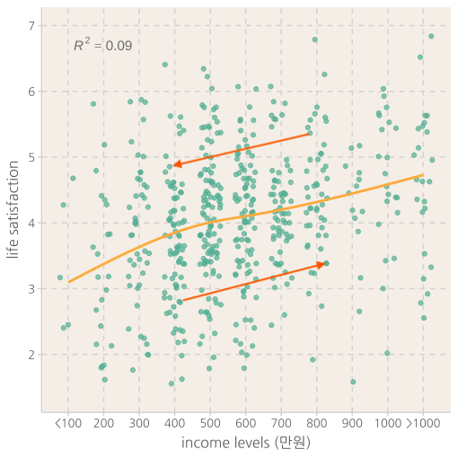{.lightbox width="400"}
- 임금 차별  
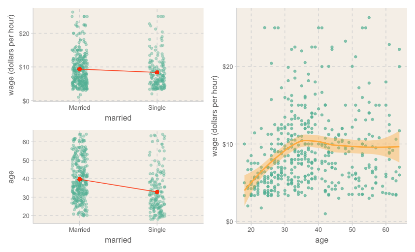{.lightbox width="750"}
- 가난, 인종, 범죄
  - [Racial differences in homicide rates are poorly explained by economics](https://randomcriticalanalysis.com/2015/11/16/racial-differences-in-homicide-rates-are-poorly-explained-by-economics/)
- 출산율의 감소  
<iframe src="https://ourworldindata.org/grapher/children-per-woman-fertility-rate-vs-level-of-prosperity" loading="lazy" style="width: 100%; height: 600px; border: 0px none;"></iframe>

### 분석가의 태도

- 심리적 관성/편견 주의
- 분석가의 책임의식
- 두 가지 접근법(예측과 이해)는 서로 상보 관계!

## 데이터 분석에 관한 전통적인 분류

:::: {.columns}
::: {.column width="50%"}
- **탐색적 분석 vs. 가설 검증**  
  **exploratory vs. confirmatory**

    - 탐색적 분석
        - 통찰 혹은 가설의 기초 제공
        - 끼워 맞추기? 오류에 빠지기 쉬움
    - 가설 검증
        - 진위의 확률을 높임
        - 탐색적 분석으로부터 온 가설은 재테스트
:::

::: {.column width="50%"}
- **관찰 vs. 실험 데이터**  
  **observational vs. experimental**

    - 당근과 시력?
    - 커피의 효과?
    - 남녀의 임금 차별?
    - 심리치료의 효과?
:::

::: {.column width="100%"}
- **표본 vs. 모집단**  
    **sample vs. population**
    
    - Parameter(모수), uncertainty(불확실성)
    - 내일 태양이 뜰 확률?
    - 연봉과 삶의 만족도와 관계
    - 성별과 임금과의 관계
    - 두통약의 효능: "effect size"

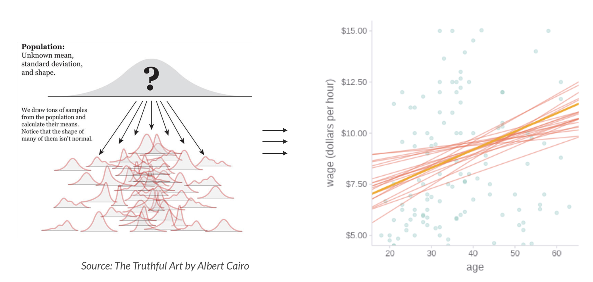{.lightbox width="700"}  
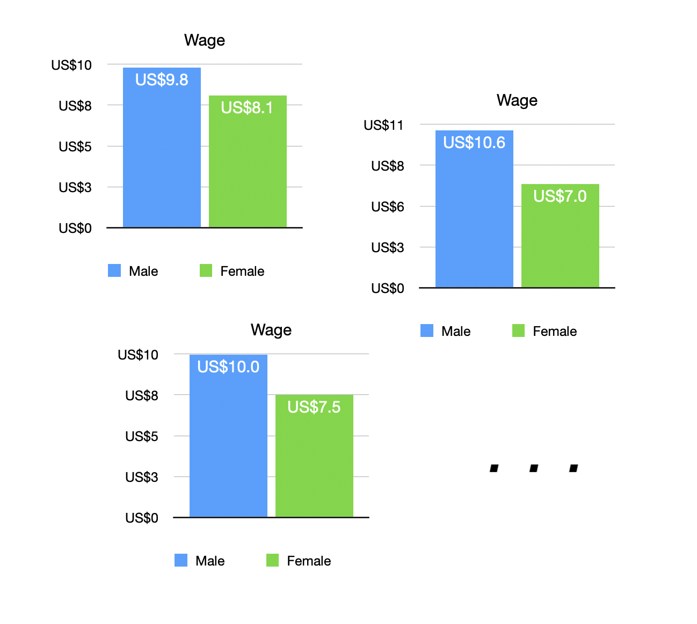{.lightbox width="400"}
:::
::::

## 통계적 사고
**Distribution**

- 남녀 임금의 차이  
&emsp;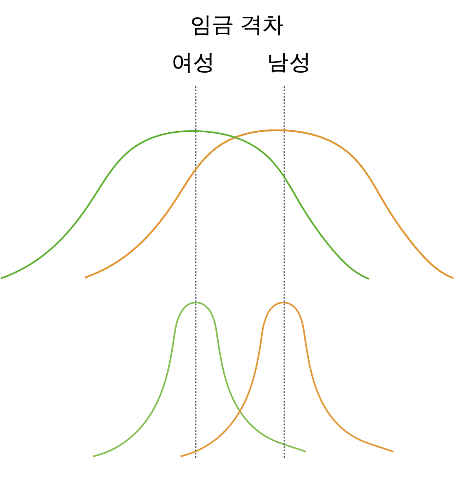{.lightbox width=300}  

### Confounding

**Common Cause**

- 머리가 길면 우울증도 높다? 
- 초등생이 발이 크면 독해력도 높다?

::: {.callout-note collapse=true}
### Answers!
Spurious relations

&emsp;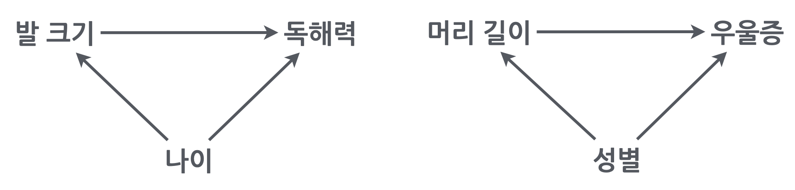{width=450}
:::

앞서 든 예도 마찬가지로  
&emsp; 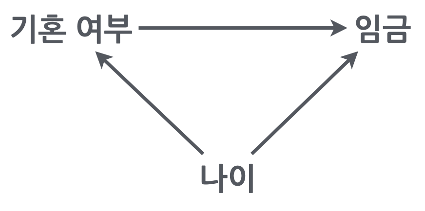{width=220}

올바른 관계를 파악하려면, 동일한 나이에 대해 그 관계를 파악한 후 각 나이에서의 효과를 (weighted) 평균해서 살펴봐야함  

통계에서는 이를 나이를 **통제 (control for age)**한다고 표현하며, 같은 의미로 다음과 같은 표현을 씀   

- 나이를 **고려**했을 때; **account for** age  
- 나이를 **조정**했을 때; **adjust for** age  
- 나이와 **무관/독립**인; **independent of** age  

**Simpson's paradox**

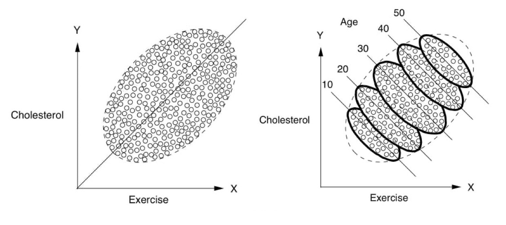{width=600}  
Source: The book of why by Judea Pearl

예를 들어, 은퇴한 노인들을 대상으로 규칙적인 걷기가 사망율을 감소시킬 것이라는 가설을 확인하기 위해 1965년 이후 8000명 가량의 남성들을 추적조사한 데이터의 일부를 이용했는데,

- 12년 후 사망율에서 casual walker(하루 1마일 이하)와 intense walker(하루 2마일 이상)가 각각 43%, 21.5%로 나타났음.
- 이 걷기의 효과를 의심케 하는 요소들(confounding)은 무엇인가?

::: {.callout-note collapse=true}
### Answers!

- 건강이 나빠 많이 걷지 못했을 수도...
- 많이 걷는 사람은 상대적으로 젊을 수도...
- 많이 먹는 사람이 덜 걸을 수도...
- 술을 많이 먹는 사람이 덜 걸을 수도...
:::

남녀 연봉 차이의 원인을 찾으려면?

- 직업 특성, 부서, 직급, 연령, 출산, 출세욕  
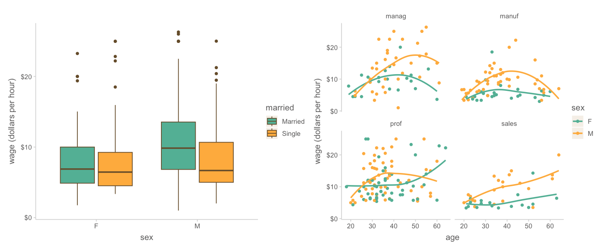{.lightbox width=800}  
{width=200}  

**Colider bias**

운동능력이 뛰어나면 지능이 떨어지는가?

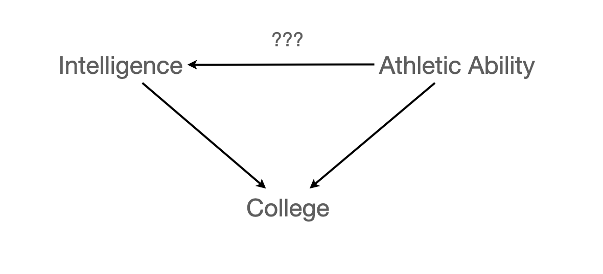{width=450}  
Source: *Statistical Modeling* by Daniel T. Kaplan

**Mechanisms/Mediation**

- 레몬과 괴혈병  
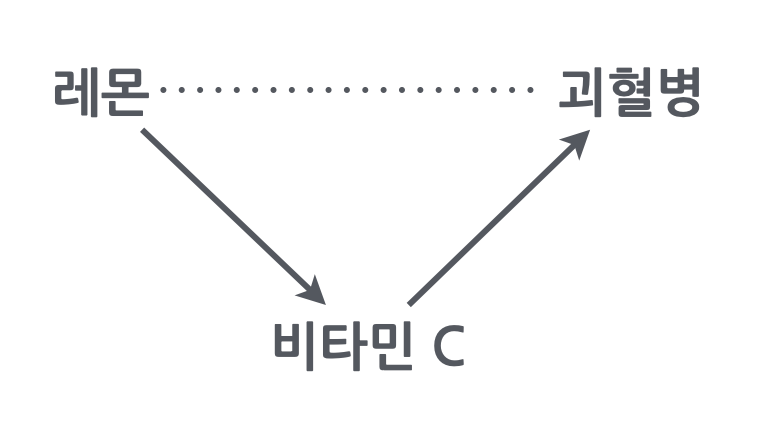{width=250}

만약, 장거리 항해에서 상급자(높은 연령)에게만 과일이 제공되었을 때, 나이가 많은 선원들에게서 괴혈병이 덜 생겼다는 현상으로부터 연령과 괴혈병의 관계를 추론해서는 안됨. 하지만 예측은 여전히 유효함.  
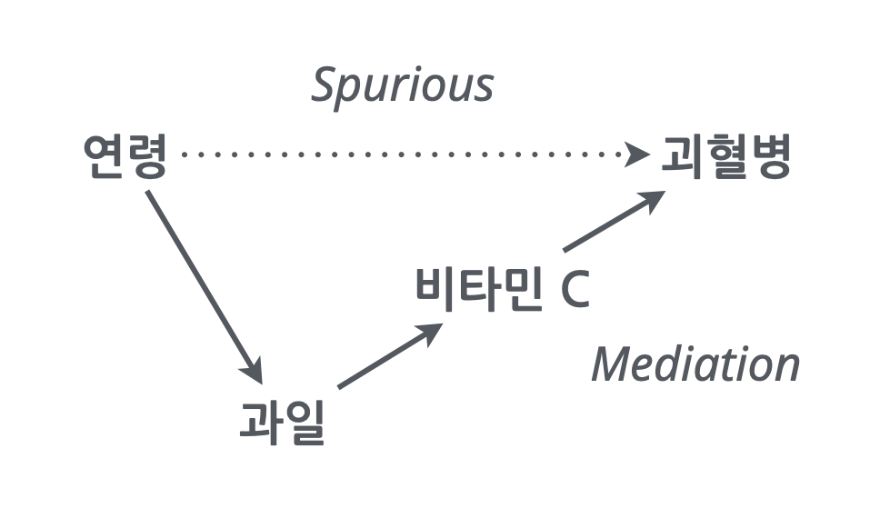{width=320}   

### 수집된 데이터의 성격  
**Selection Bias**

수집된 데이터의 성격에 따라 인과추론을 방해하거나(confounding)  
일반화할 수 있는 대상의 범위가 제한됨(external validity)

- 노인에 관한 데이터: 누가 사망했는가?
- 과거 기록을 이용?
- 회사 구성원에 대한 조사: 근속년수에 따른 샘플 속성의 변화
- 누가 참여했는가? 어떤 방식으로 참여했는가?
  - 관측되지 않은 데이터: 어떤 사람/대상이 왜 누락되었는가?
- 어떤 유저들의 데이터인가?: SNS의 기록은 누가 남기는가?
- 코호트/특정세대의 특성: 그들의 특성인가?

### 실험
**Experiment**

RCT (randomized controlled trial)

- 개념적으로는 물리적 통제라고 볼 수 있으며, 
- 두 그룹으로 집단을 randomly assign(무선/무작위 배정/할당)

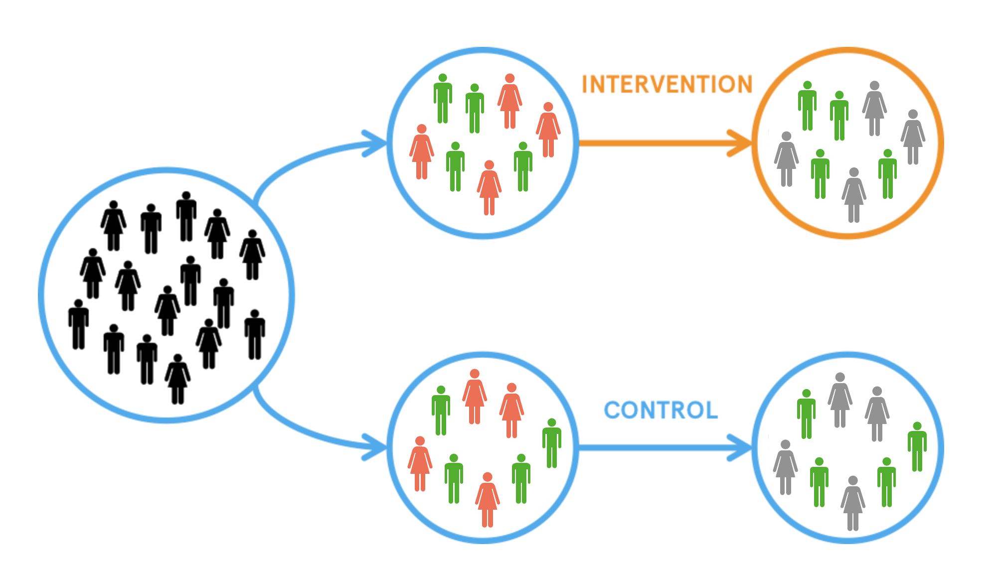{width=400}